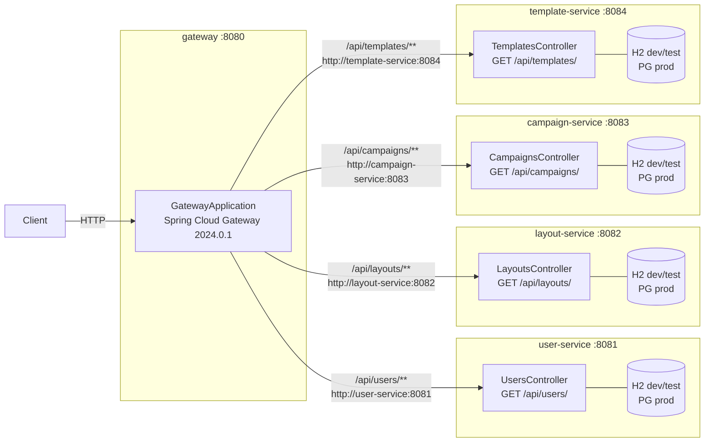
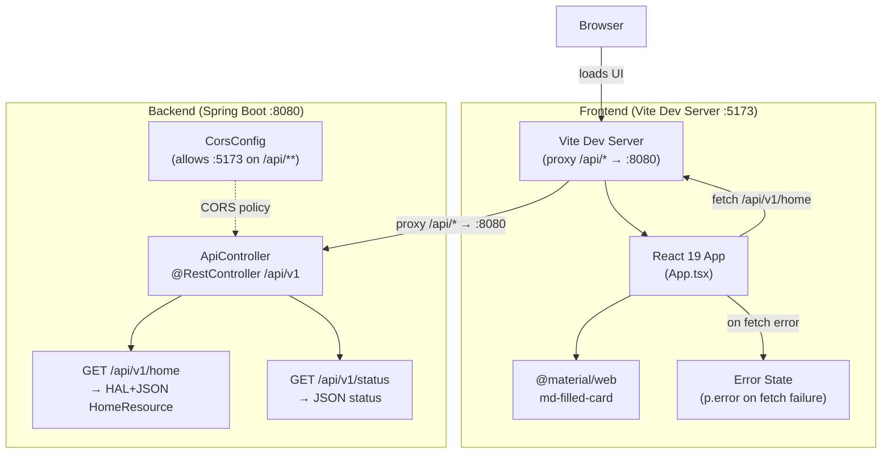
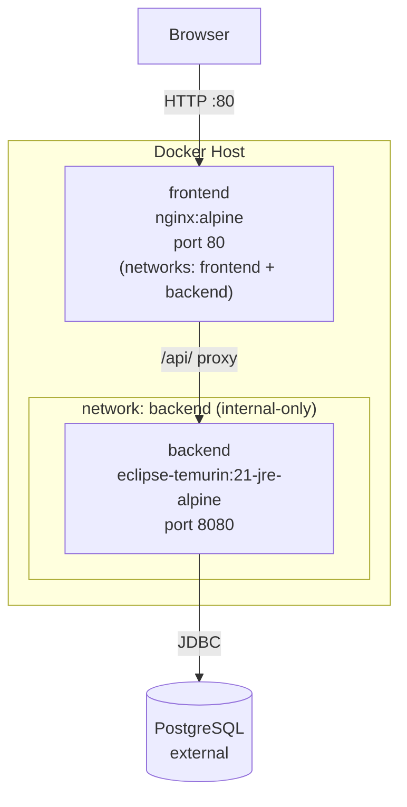
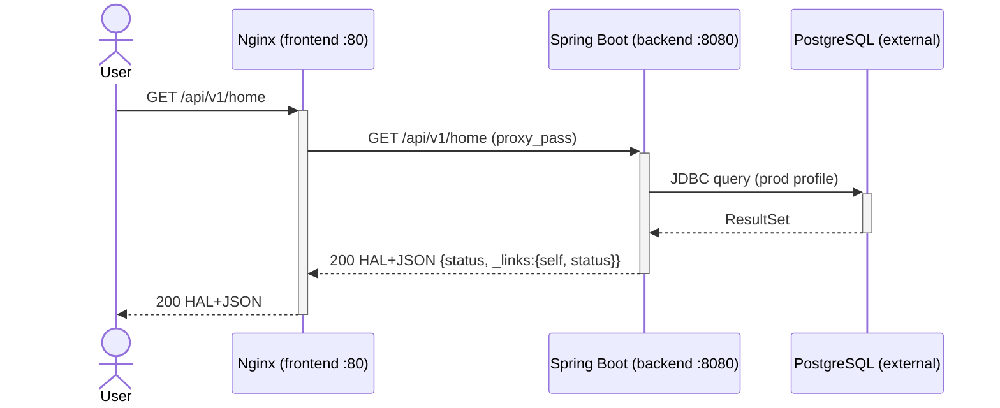
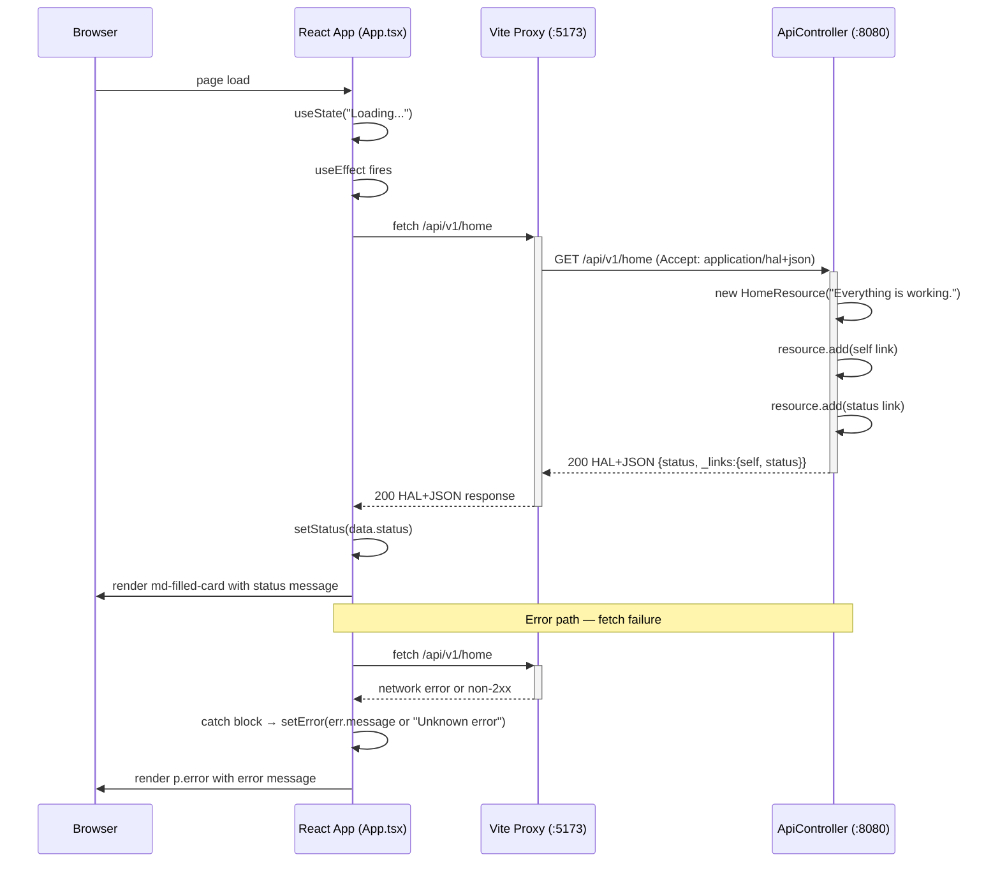
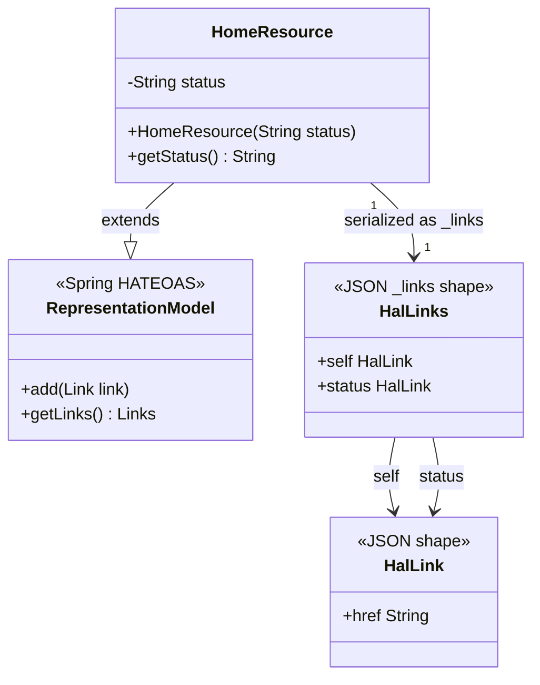
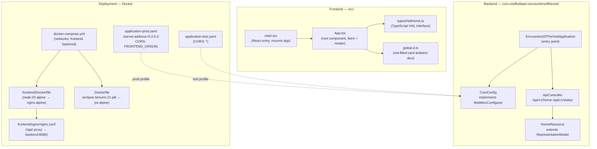

# Architecture — Encounters of the Void

System overview for the Spring Boot HAL API + React frontend stack.

## Multi-Module SCS Architecture (TECH-012)

Maven multi-module project: a Spring Cloud Gateway entry point routes traffic to four self-contained Spring Boot microservices. Each service manages its own H2 (dev/test) or PostgreSQL (prod) datasource.

Source: [`docs/diagrams/architecture.md`](diagrams/architecture.md)

## System Architecture (Legacy Monolith)

Overall topology: browser loads the React/Vite frontend, which proxies API calls to the Spring Boot backend.

Source: [`docs/diagrams/architecture.mmd`](diagrams/architecture.mmd)

## Production Deployment

Containerised deployment via Docker Compose (TECH-004). The Nginx frontend container is the sole public entry point on port 80; the Spring Boot backend is on an internal-only network unreachable from outside Docker.

Source: [`docs/diagrams/architecture.mmd`](diagrams/architecture.mmd)

## Production API Flow

Browser request proxied through Nginx to the Spring Boot backend over the internal Docker network:

Source: [`docs/diagrams/sequence-diagram.md`](diagrams/sequence-diagram.md)

## API Flow (Development)

HAL home fetch (happy path and error path):

Source: [`docs/diagrams/api-flow.mmd`](diagrams/api-flow.mmd)

## Data Model

Java model classes and HAL serialisation shape:

Source: [`docs/diagrams/data-model.mmd`](diagrams/data-model.mmd)

## Component Breakdown

Module-level component map:

Source: [`docs/diagrams/component.mmd`](diagrams/component.mmd)
