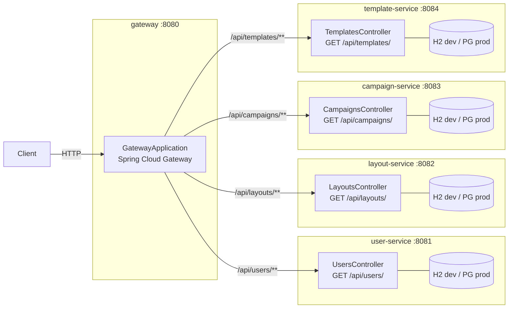
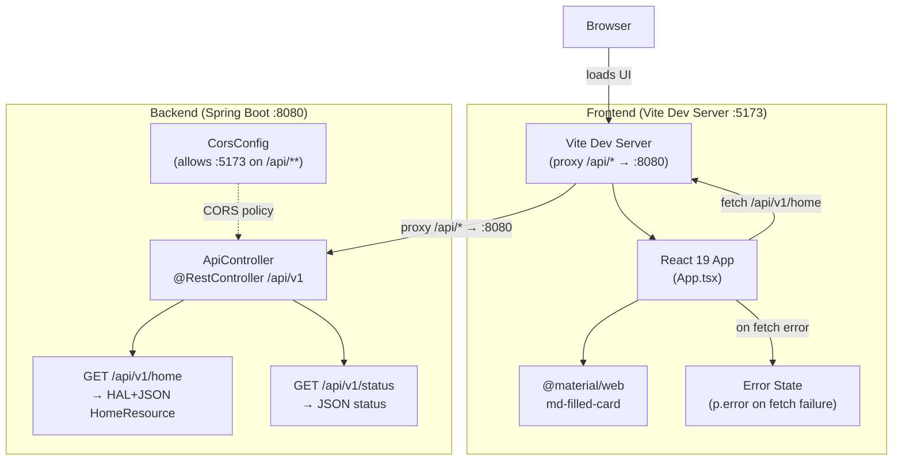
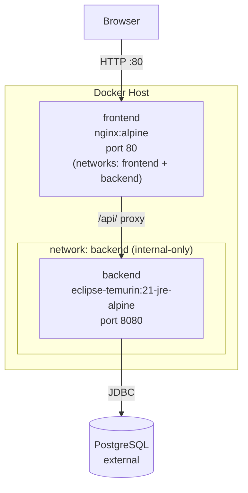
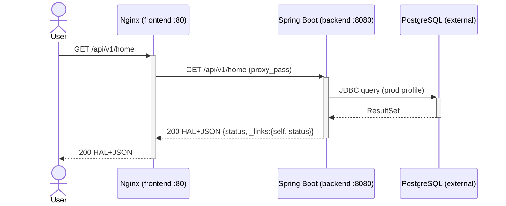
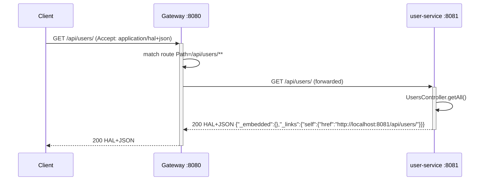
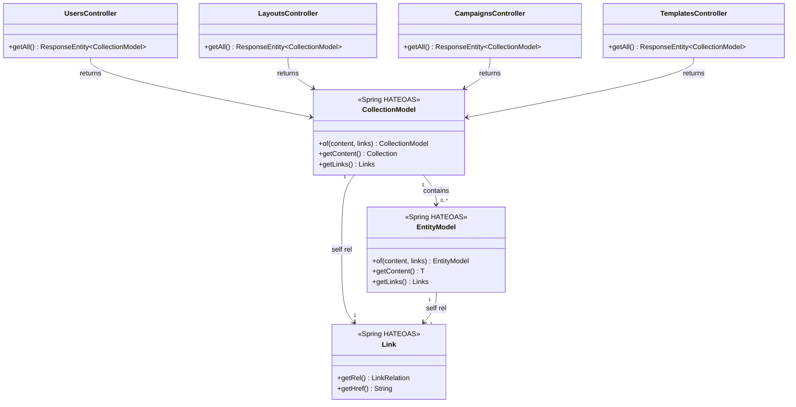
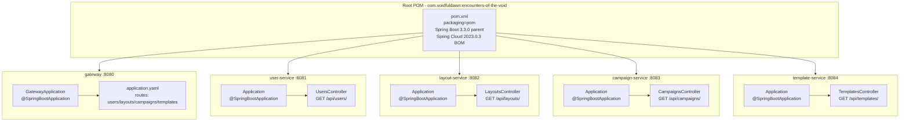

# Architecture — Encounters of the Void

System overview for the Encounters of the Void Maven multi-module microservices stack.

## Multi-Module SCS Architecture (TECH-012)

Maven multi-module project with a Spring Cloud Gateway entry point routing to four self-contained Spring Boot microservices. Each SCS serves a HAL+JSON collection endpoint.

Source: [`docs/diagrams/architecture.mmd`](diagrams/architecture.mmd) | Full detail: [`docs/diagrams/architecture.md`](diagrams/architecture.md)

### Gateway Route Configuration

| Route ID | Path Predicate | Upstream URI |
|----------|---------------|--------------|
| user-service | `/api/users/**` | `http://localhost:8081` |
| layout-service | `/api/layouts/**` | `http://localhost:8082` |
| campaign-service | `/api/campaigns/**` | `http://localhost:8083` |
| template-service | `/api/templates/**` | `http://localhost:8084` |

### SCS Datasource Profiles

| Profile | Datasource | DDL |
|---------|-----------|-----|
| default (dev) | H2 in-memory | `update` |
| `prod` | PostgreSQL via env vars | `validate` |
| `test` | H2 in-memory | `create-drop` |

---

## Legacy Monolith Architecture (pre-TECH-012)

Overall topology: browser loads the React/Vite frontend, which proxies API calls to the Spring Boot backend.

Source: [`docs/diagrams/architecture.mmd`](diagrams/architecture.mmd)

## Production Deployment

Containerised deployment via Docker Compose (TECH-004). The Nginx frontend container is the sole public entry point on port 80; the Spring Boot backend is on an internal-only network unreachable from outside Docker.

Source: [`docs/diagrams/architecture.mmd`](diagrams/architecture.mmd)

## Production API Flow

Browser request proxied through Nginx to the Spring Boot backend over the internal Docker network:

Source: [`docs/diagrams/sequence-diagram.md`](diagrams/sequence-diagram.md)

## SCS API Flow (TECH-012)

Gateway receives a request, matches a route predicate, and forwards to the appropriate self-contained service which returns a HAL+JSON collection response:

Source: [`docs/diagrams/api-flow.mmd`](diagrams/api-flow.mmd) | Full flows: [`docs/diagrams/sequence-diagram.md`](diagrams/sequence-diagram.md)

### Legacy Monolith API Flow (pre-TECH-012)

HAL home fetch through React/Vite dev server to the monolith backend:

## Data Model (TECH-012)

HAL response model used by all four SCS controllers — each returns a `CollectionModel<EntityModel<String>>` with a self link. No JPA entities exist in the current skeleton implementation.

Source: [`docs/diagrams/data-model.mmd`](diagrams/data-model.mmd) | Full detail: [`docs/diagrams/class-diagram.md`](diagrams/class-diagram.md)

## Component Breakdown (TECH-012)

Maven multi-module component map showing all five new modules:

Source: [`docs/diagrams/component.mmd`](diagrams/component.mmd)
