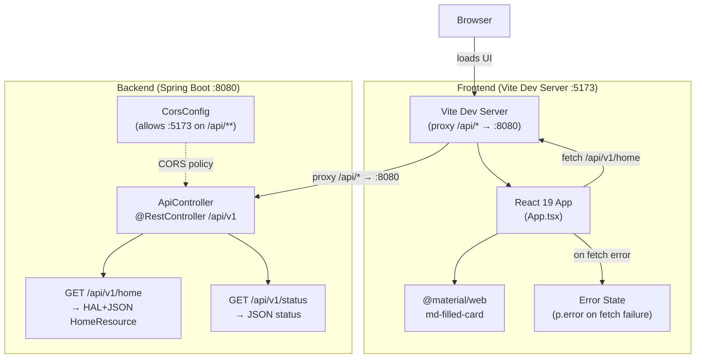
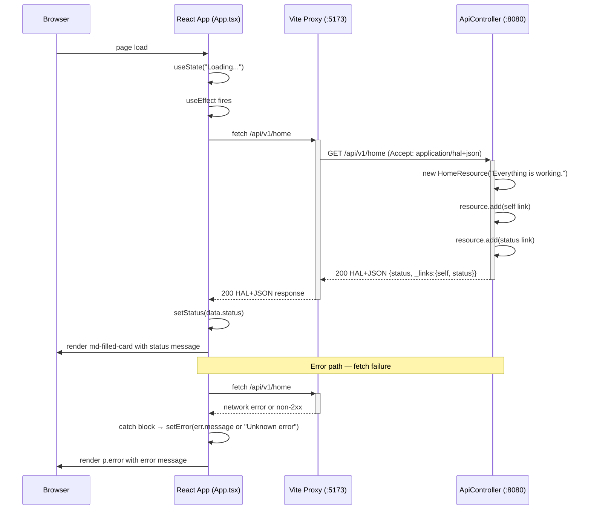
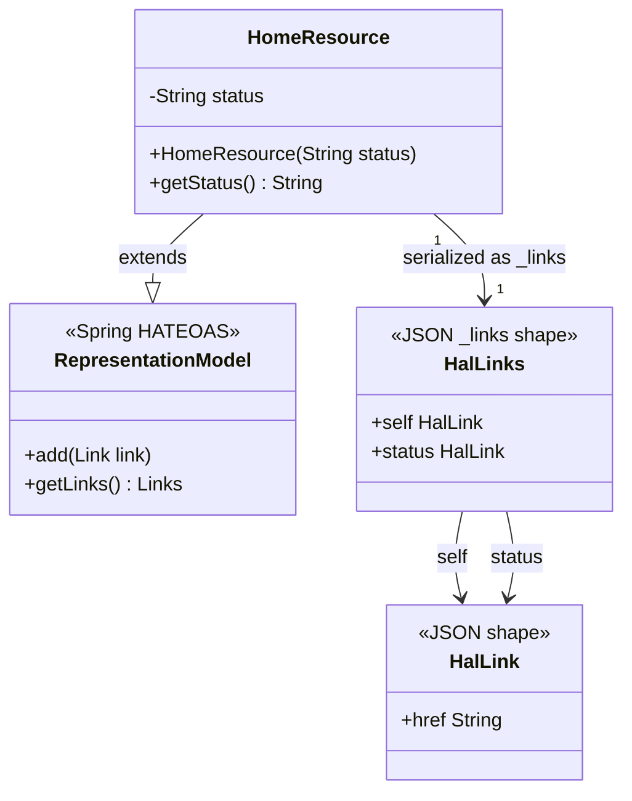
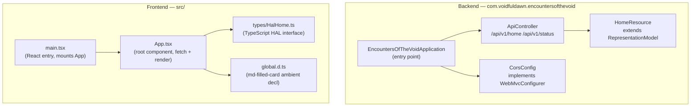

# Architecture — Encounters of the Void

System overview for the Spring Boot HAL API + React frontend stack.

## System Architecture

Overall topology: browser loads the React/Vite frontend, which proxies API calls to the Spring Boot backend.

Source: [`docs/diagrams/architecture.mmd`](diagrams/architecture.mmd)

## API Flow

HAL home fetch (happy path and error path):

Source: [`docs/diagrams/api-flow.mmd`](diagrams/api-flow.mmd)

## Data Model

Java model classes and HAL serialisation shape:

Source: [`docs/diagrams/data-model.mmd`](diagrams/data-model.mmd)

## Component Breakdown

Module-level component map:

Source: [`docs/diagrams/component.mmd`](diagrams/component.mmd)
