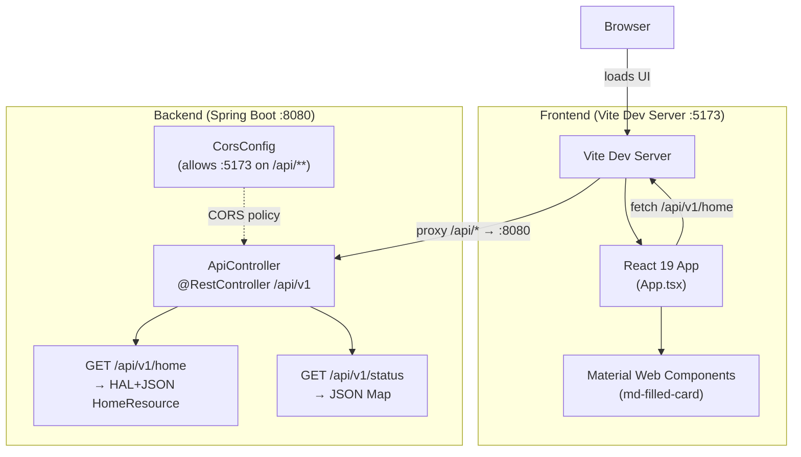

# Architecture Diagram

System topology for Encounters of the Void.

```mermaid
graph TD
    Browser["Browser"]

    subgraph Frontend ["Frontend (Vite Dev Server :5173)"]
        Vite["Vite Dev Server"]
        React["React 19 App\n(App.tsx)"]
        MWC["Material Web Components\n(md-filled-card)"]
    end

    subgraph Backend ["Backend (Spring Boot :8080)"]
        Controller["ApiController\n@RestController /api/v1"]
        HomeEP["GET /api/v1/home\n→ HAL+JSON HomeResource"]
        StatusEP["GET /api/v1/status\n→ JSON Map"]
        CorsConfig["CorsConfig\n(allows :5173 on /api/**)"]
    end

    Browser -->|"loads UI"| Vite
    Vite --> React
    React --> MWC
    React -->|"fetch /api/v1/home"| Vite
    Vite -->|"proxy /api/* → :8080"| Controller
    Controller --> HomeEP
    Controller --> StatusEP
    CorsConfig -.->|"CORS policy"| Controller
```
