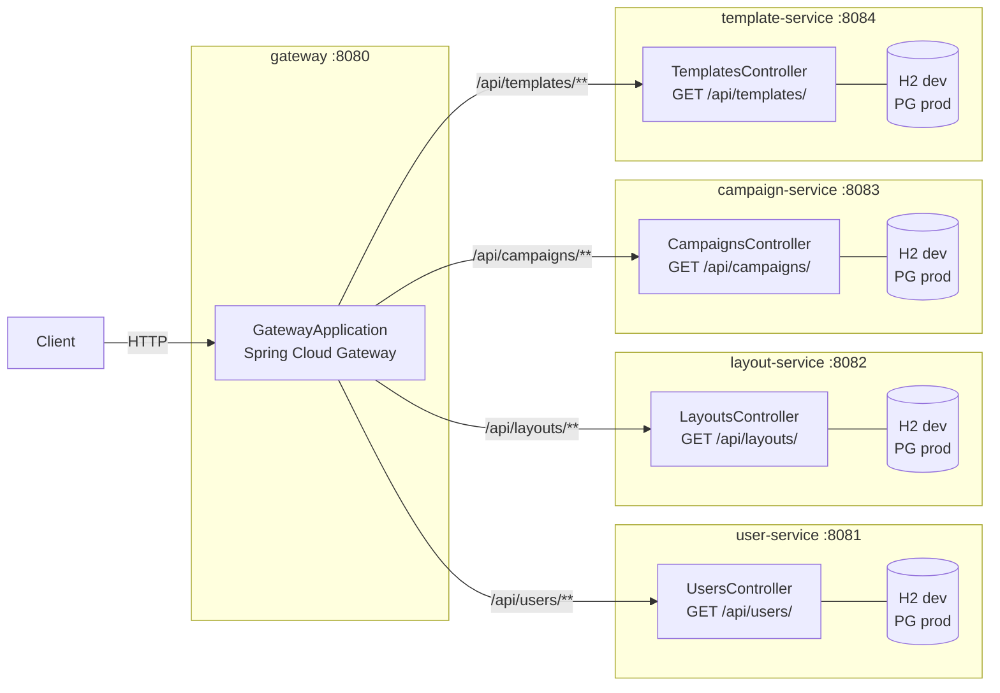
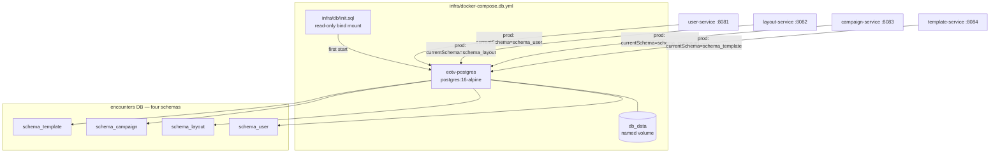
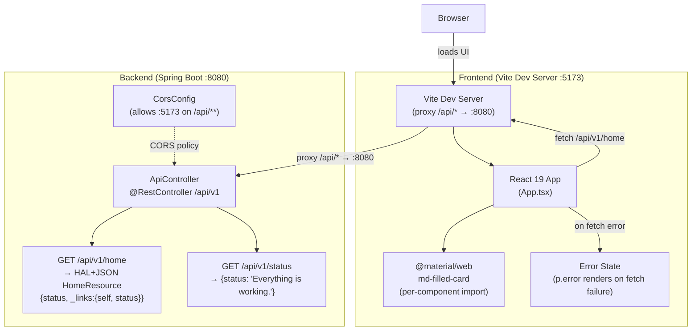
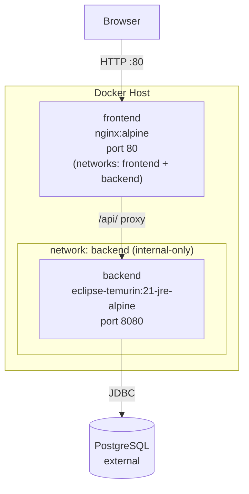

# Architecture Diagram

System topology for Encounters of the Void.

## Multi-Module SCS Architecture (TECH-012)

Maven multi-module project with a Spring Cloud Gateway entry point routing to four self-contained Spring Boot microservices.

> **Versions:** Spring Boot 3.3.6 / Spring Cloud 2024.0.1 / Java 21

### Gateway Route Configuration (`gateway/src/main/resources/application.yaml`)

| Route ID | Path Predicate | Upstream URI |
|----------|---------------|--------------|
| user-service | `/api/users/**` | `http://user-service:8081` |
| layout-service | `/api/layouts/**` | `http://layout-service:8082` |
| campaign-service | `/api/campaigns/**` | `http://campaign-service:8083` |
| template-service | `/api/templates/**` | `http://template-service:8084` |

### SCS Datasource Profiles

| Profile | Datasource | DDL |
|---------|-----------|-----|
| default (dev) | H2 in-memory (`jdbc:h2:mem:<service>db`) | `create-drop` |
| `prod` | PostgreSQL via `${DB_URL}` / `${DB_USERNAME}` / `${DB_PASSWORD}` | `validate` |
| `test` | H2 in-memory (`jdbc:h2:mem:<service>testdb;DB_CLOSE_DELAY=-1`) | `create-drop` |

---

## Shared PostgreSQL Infrastructure (TECH-013)

`infra/docker-compose.db.yml` provides a standalone PostgreSQL 16 container for local development.
It is intentionally **not** joined to the `backend` Docker network so that Spring services running
directly on the host (or in an IDE) can reach the database at `localhost:${DB_PORT}`.

### Environment Variables (`.env.example`)

| Variable | Description | Example |
|----------|-------------|---------|
| `DB_HOST` | Hostname or IP of the Postgres node | `localhost` |
| `DB_PORT` | TCP port | `5432` |
| `DB_NAME` | Database name | `encounters` |
| `DB_USER` | Postgres superuser role (Docker Compose) | `eotv_user` |
| `DB_USERNAME` | Datasource username for Spring services | `eotv_user` |
| `DB_PASSWORD` | Database password | *(secret)* |

> `DB_USER` configures the Postgres container; `DB_USERNAME` is read by each SCS `application-prod.yaml`.

---

## Legacy Monolith + Docker Topology (pre-TECH-012)

The original single-module backend with Vite dev server and Docker Compose deployment.

## Production Deployment Topology

Docker Compose brings up two containers on isolated networks. The backend is on an internal-only network; the frontend bridges both networks and is the sole public entry point.

## Component Notes

| Component | Details |
|-----------|---------|
| React 19 (`App.tsx`) | Single component; two states: `status` (string) and `error` (string \| null); `useEffect` fires fetch on mount |
| MWC import | Per-component: `@material/web/labs/card/filled-card.js` (not the bulk `all.js`) |
| Vite proxy | `vite.config.ts` maps `/api/*` → `http://localhost:8080`; no env var needed in dev |
| Error handling | `.catch()` in `useEffect` calls `setError()` with the error message; renders `
` (not `md-filled-card`) when `error` state is non-null |
| CORS | `CorsConfig` permits `GET, POST, OPTIONS` from `http://localhost:5173` on `/api/**` |
