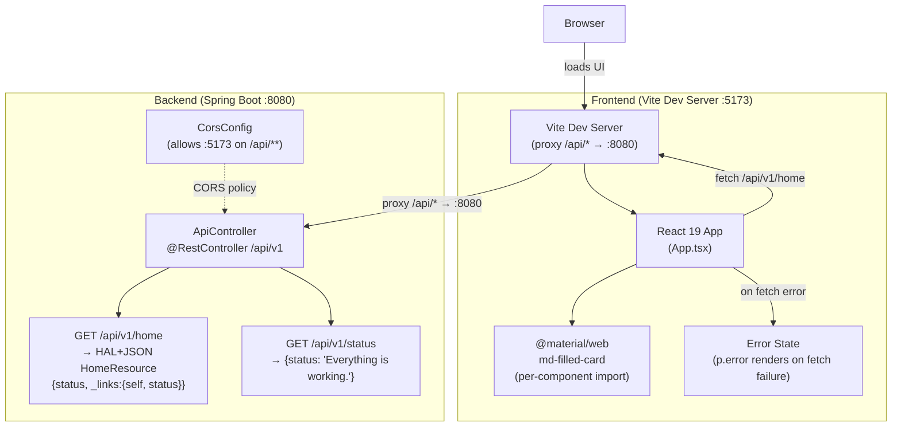
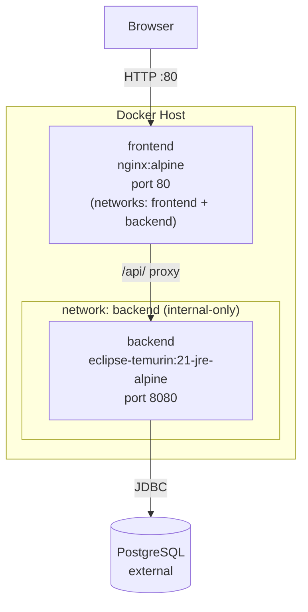

# Architecture Diagram

System topology for Encounters of the Void.

## Production Deployment Topology

Docker Compose brings up two containers on isolated networks. The backend is on an internal-only network; the frontend bridges both networks and is the sole public entry point.

## Component Notes

| Component | Details |
|-----------|---------|
| React 19 (`App.tsx`) | Single component; two states: `status` (string) and `error` (string \| null); `useEffect` fires fetch on mount |
| MWC import | Per-component: `@material/web/labs/card/filled-card.js` (not the bulk `all.js`) |
| Vite proxy | `vite.config.ts` maps `/api/*` → `http://localhost:8080`; no env var needed in dev |
| Error handling | `.catch()` in `useEffect` calls `setError()` with the error message; renders `
` (not `md-filled-card`) when `error` state is non-null |
| CORS | `CorsConfig` permits `GET, POST, OPTIONS` from `http://localhost:5173` on `/api/**` |
