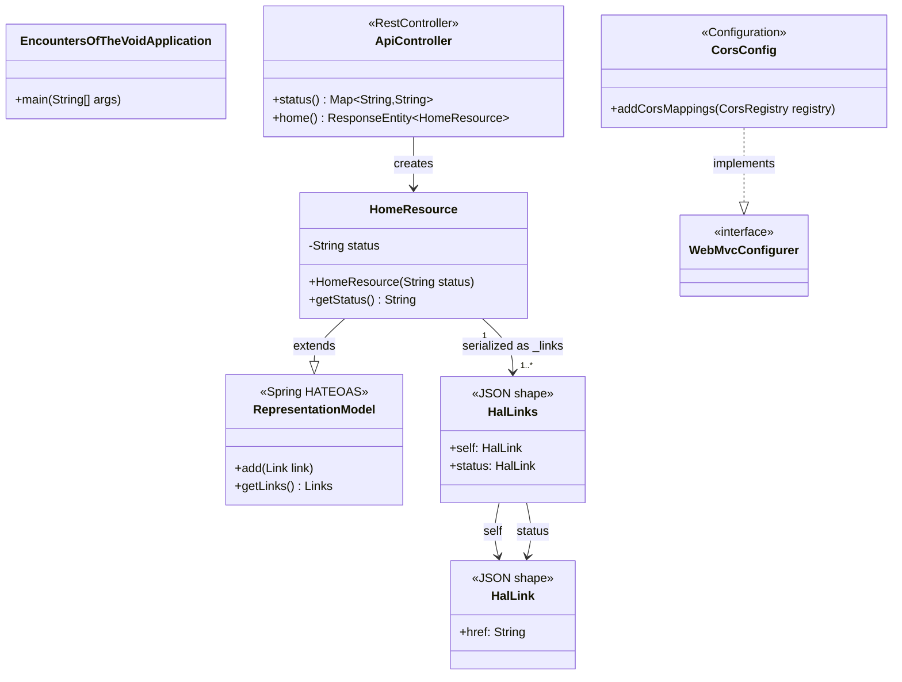

# Class Diagram

Key Java classes and their relationships.



## Frontend Components

| File | Role |
|------|------|
| `App.tsx` | Root component; `useState<string>('Loading...')` holds `status`; `useEffect` fetches `/api/v1/home` on mount, calls `setStatus(data.status)` on success or `setStatus('Failed to load status.')` on error |
| `main.tsx` | React entry point; mounts `<App />` into `#root` |
| `global.d.ts` | TypeScript ambient declarations for Material Web custom elements (`md-filled-card`) |
| `types/HalHome.ts` | TypeScript interface for the HAL+JSON response: `{ status: string; _links: { self: { href: string }; status: { href: string } } }` |

## HAL+JSON Response Shape

```json
{
  "status": "Everything is working.",
  "_links": {
    "self":   { "href": "http://localhost:8080/api/v1/home" },
    "status": { "href": "http://localhost:8080/api/v1/status" }
  }
}
```
