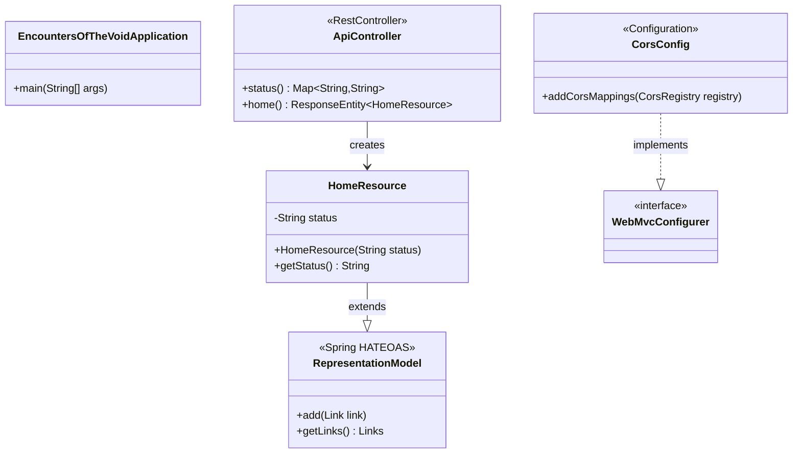

# Class Diagram

Key Java classes and their relationships.

## Frontend Components

| File | Role |
|------|------|
| `App.tsx` | Root component; fetches `/api/v1/home` via `useEffect`, passes status string to render |
| `main.tsx` | React entry point; mounts `<App />` into `#root` |
| `global.d.ts` | TypeScript ambient declarations for Material Web custom elements |
| `types/HalHome.ts` | TypeScript interface for the HAL+JSON `HomeResource` response shape |
