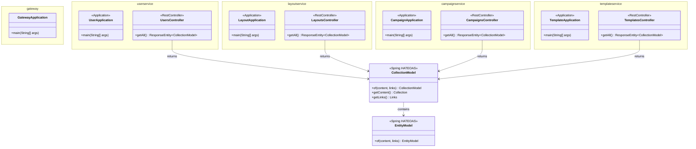
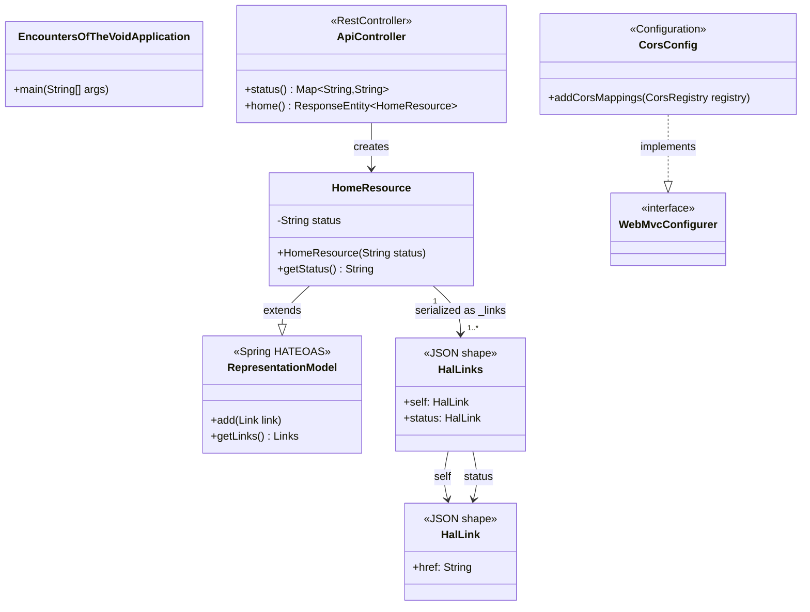

# Class Diagram

Key Java classes and their relationships.

## Multi-Module SCS Classes (TECH-012)

Entry points and controllers for the 5 new modules, all under `com.voidfuldawn.encountersofthevoid`.



### HAL+JSON Response Shape (SCS root endpoints)

```json
{
  "_embedded": {},
  "_links": {
    "self": { "href": "http://localhost:808x/api/<domain>/" }
  }
}
```

---

## Legacy Monolith Classes (pre-TECH-012)



## Frontend Components

| File | Role |
|------|------|
| `App.tsx` | Root component; two states: `status: string` (init `'Loading...'`) and `error: string \| null` (init `null`); `useEffect` fetches `/api/v1/home` on mount, calls `setStatus(data.status)` on success or `setError(err instanceof Error ? err.message : 'Unknown error')` on error; renders `<p className="error">` when error is non-null, else `<md-filled-card>` |
| `main.tsx` | React entry point; mounts `<App />` into `#root` |
| `global.d.ts` | TypeScript ambient declarations for Material Web custom elements (`md-filled-card`) |
| `types/HalHome.ts` | TypeScript interface for the HAL+JSON response: `{ status: string; _links: { self: { href: string }; status: { href: string } } }` |

## HAL+JSON Response Shape (legacy)

```json
{
  "status": "Everything is working.",
  "_links": {
    "self":   { "href": "http://localhost:8080/api/v1/home" },
    "status": { "href": "http://localhost:8080/api/v1/status" }
  }
}
```
