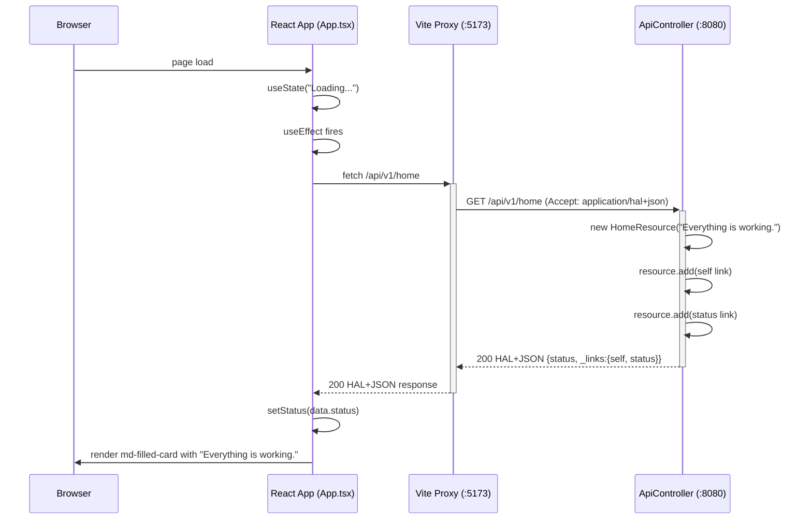
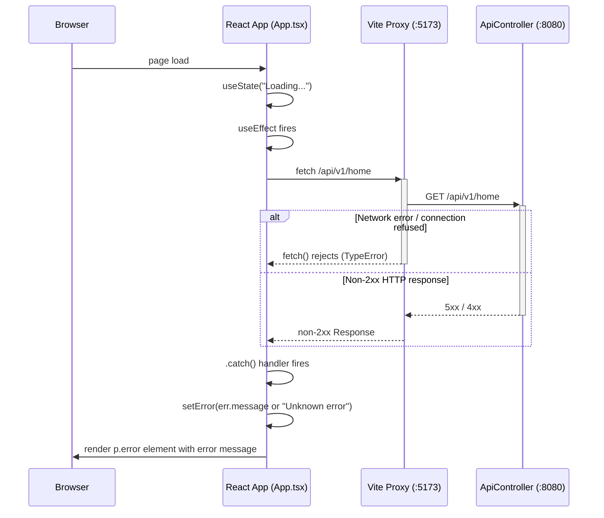
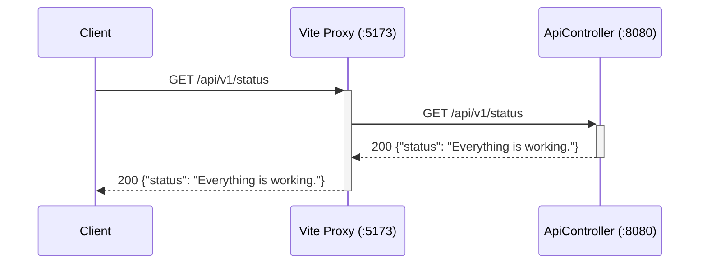

# Sequence Diagrams

Request flows through the Encounters of the Void stack.

## Flow 1: Happy Path — HAL Home Fetch + Frontend Render

React app starts, fetches the HAL home resource, and renders the status message using a Material Web Component.

## Flow 2: Error Path — Fetch Failure → Error State Render

Network error or non-2xx response is caught and surfaced to the user without crashing the app.

## Flow 3: GET /api/v1/status

Simple JSON health-check endpoint (direct backend call, bypasses the React app).

