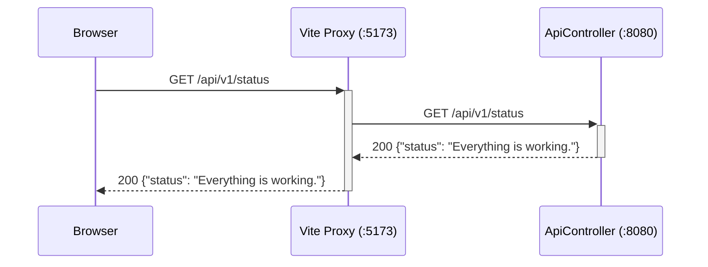
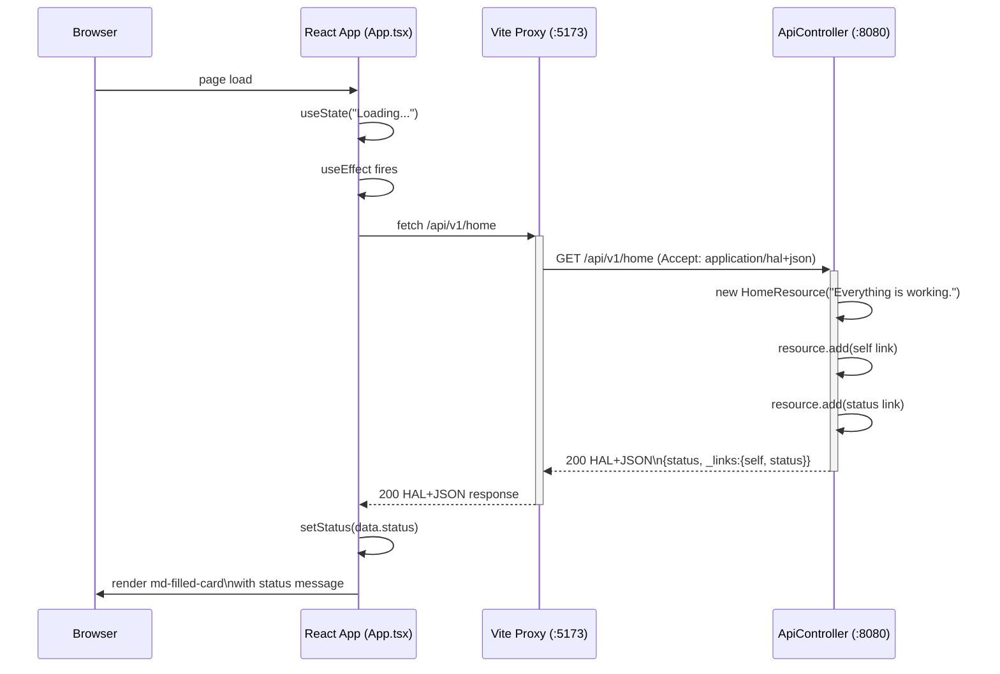

# Sequence Diagrams

Request flows through the Encounters of the Void stack.

## Flow 1: GET /api/v1/status

Simple JSON health-check endpoint.

## Flow 2: HAL Home Fetch + Frontend Render

React app starts, fetches the HAL home resource, and renders the status message using a Material Web Component.

